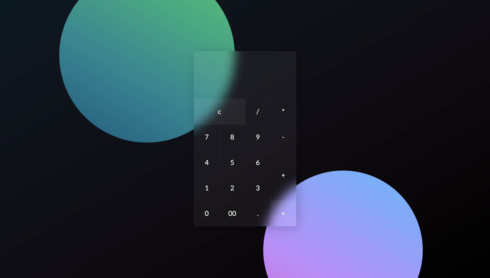

# Glassmorphism Calculator

## Created October 25, 2022

### **Preview**

### **Time spent on project**
1 hour

### **Programming Language**
JavaScript

### **Front End Development**
HTML, CSS

### **How to Run Project**
1. Download HTML, CSS, JavaScript, and images 
2. Open HTML file in browser

### **New Things I Learned**
- Learned how to create a smooth 3D tilt using a JavaScript library
- Learned and practice using pseudo-elements (::before and ::after)

### **LinkedIn**
https://www.linkedin.com/in/mixie-clerard/

### **Email**
clerardm@gmail.com